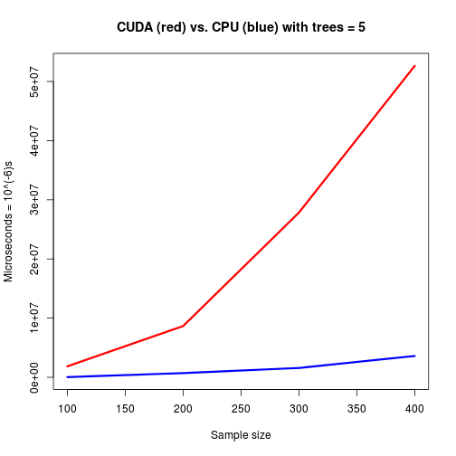
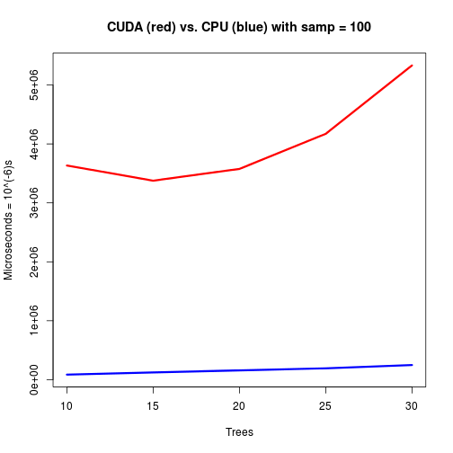
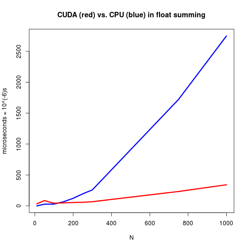
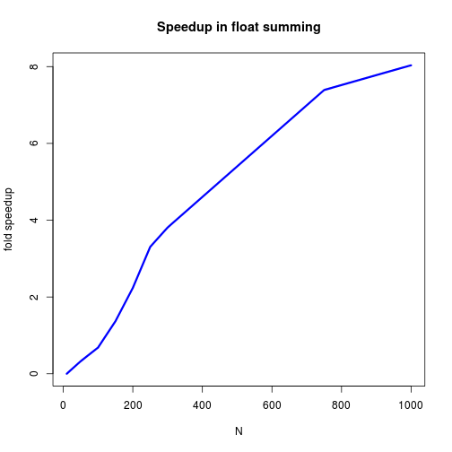
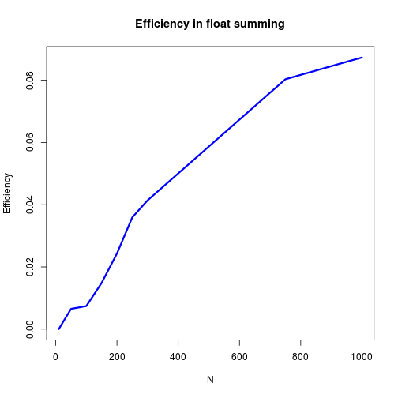

# CUDA is not meant for training random forests

This is an example of me learning CUDA through attempting to train a random forest.

## Overview 

In this report I describe random forests, how they are trained, how CUDA works, and why the two are not meant for each other. A link to the random forest training code can be found in the porfolio homepage.

## Terminology

For my purposes, a datum is a single observation in nature manifested in data as a list of numbers. For example, x is a datum with n dimension.

```
x = (x1 , x2, ... , xn)
```

Random forests can be used for regression as well as classification. Here, we only consider classification.

The Graphics Processing Unit (GPU) is often call the 'device' and the machine's CPU the 'host'.

## What is a classification tree?

A classification tree is a graph used for classification. The tree has a root. Each node stores a pivot, and either pointers to children or classification labels. The pivot is a rule for deciding which child to point to or classification to make. In my software, the tree is a bifurcation tree, so we say the node can have a left and right child. I implement nodes in my software as 6-tuples. The dim and rule make up the pivot. For an incoming datum, y, in need of classification, we look the 'dim' dimension of y and check the value is above or below 'rule'. If the value is below, y belongs to the left, otherwise the right. The nodes also store classification labels, describing its left and right categories. Thus for a classification tree, the nodes represent classification rules into left and right categories. Edges represent directions from a parent to children nodes, which also act as classifiers.

```
 node = ( dim , rule , left child , right child , left classification , right classification )
```

To classify an incoming datum, start at the root of the classification tree. Check the datum against the pivot. If the datum is less than the pivot, move the datum to the left child, otherwise the right. Iteratively continue to move the datum down the tree using this same rule. If there is no child, instead label the datum according to the local node's classification rules.

## What is a random forest?

Classification trees have an interesting property of tending to be unbiased, high-variance classifiers. This means that they make a lot of mistakes, but perform well on average. A random forest takes advantage of this property by having many classification trees. Any incoming datum is classified by all trees, then the trees vote for which classification the datum recieves. The most common classification is given to the datum as its predicted label. The more trees, the better.

## How is a random forest trained?

Because of the generality of the the random forest classifier, it must be fit to training data before classifying may start. To train a forest, we train the trees. Of the training data set, each tree gets a random subset. Each tree is fit to its own subset. To fit a tree, we fit a node--we find the best pivot for that subset. Then, using the new pivot, the data is broken into two subsets, the left and right. Child-nodes can be trained on the left and right subsets. Thus each node has the ability ask for two children to be trained.

## Parallelizable opportunities exist

The training of a random forest is parallelizable in at least two ways. First, each tree is calculated independently and thus is embarassingly parallel. Second, each depth in the classification tree is a set of nodes which may be computed in parallel, requiring a communication step between depths. I've attempted both of these options. 

## CUDA

CUDA is NVIDIA's language for scientific computing on their GPUs. I've used C-extended CUDA. Impressive statistics can be found describing NVIDIA's GPUs. For example, the QUADRO K6000 has 2880 CUDA cores. Or even my little consumer-grade latop has GeForce GT 620M, which has 96 CUDA cores. That's a lot of potential waiting to be uncovered. However, there are some caveats that need to be worked with.

### Multiprocessors

CUDA cores do not act independently. While running, they are automatically organized into concurrently operating threads called 'warps'. The GPU, which often has only one or two mutliprocessors, runs the entire warp on a single multiprocessor. Every CUDA core in the warp is capable of running concurrently on the warp, but the multiprocessor imposes a serious constraint: the instruction on each thread in the warp must be the same. If instructions differ, a thread will wait.

#### Implications of multiprocessing

Using a multiprocessor to achieve vast parallelism will likely remain a cheap and efficient option well into the future. However, they are constrained in the problems they are able to work on. As the title of this report may suggest, even a little path complexity could result in the algorithm not being worthwhile to implement in CUDA. However, there are certainly simple algorithms that are very multiprocessor-friendly. Such algorithms stand a chance to be vastly spead-up cheaply and efficiently. An example is matrix multiplication. This shouldn't be suprising, because GPUs were developed (of course) for graphics, where matrix arithmetic is a staple calculation.

### Communication time 

High quality, modern GPUs are not located on the mother board. Communication is via the PCI Express bus.

#### Implications of communication time

It is often advised that O(n) algorithms should not be computed on the GPU, because it will take O(n) time to communicate the data. CUDA is designed to easily implement asychronus behaviour, encouraging pipeline usage. Most developers desire strongly to 'keep the device busy'.

### Limited RAM

Many NVIDIA GPUs have 1Gb of shared (amongst CUDA cores) RAM. Also, allocations tend to be needlessly large. 

#### Implications of limitted RAM

Matricies should be allocated as arrays (do not use arrays of arrays). Spatial complexity of the algorithm should be low.

### Dynamic parallelism is expensive 

Dynamic parallelism is a CUDA feature available in only a few NVIDIA products. It enables CUDA threads to allocate more threads to a task. In the language of CUDA, it allows a kernel to call a kernel.

NVIDIA uses a hardware versioning system to describe what a GPU is capable of called 'compute capability'. Old cards tend to have a compute capability below 2.0 and do not even have 'printf' natively implemented. Compute capabilities below 3.0 are now very common and reasonably priced for the consumer video gaming market (hundreds of dollars). 'Dynamic Parallelism' is a feature made available in compute capability 3.5. NVIDIA cards with compute capability 3.5 are likely not targetting the video gaming market due to the higher prices (thousands of dollars).

### The ideal CUDA process

With these limitations in mind, we should imagine a situation which results in us attaining the awesome efficiency of a GPU. Firstly, the algorithm must be massively parallelizable, ideally with thousands of threads. To satisfy the multiprocessor, we can only allow a single path of execution. To satisfy the communication inefficiency, our algorithm should be of greater time complexity than the spatial complexity of its inputs and outputs. Further, because of the limitted RAM, the spatial complexity of the algoirthm must be low. A summary follows.

* Massively parrallelizable
* Single execution path
* Greater algorithmic time complexity than input & output spatial complexity
* Low algorithmic spatial complexity

## Random forest training on CUDA

Having attempted the exercise of training a random forest on a GPU and learned much about CUDA in the process, I have since realized the inadequacy of CUDA for this task. Upon starting the task I was quite optimistic. Having put many hours into it, my single-thread implementation is still faster. It should be noted that my results aren't exactly atypical: a more successful implementation (available online), cudaTree, achieves speedups like 5x and 6x. In the best of situations, speedups from GPUs can be in the tens or hundreds of times. Most importantly, CUDA has a scope of application, and it shouldn't be used outside of its scope.

### What did I try?

Using a compute capability 2.0 GPU with 96 CUDA cores, I attempted to write a CUDA-friendly random forest training algorithm. Initially I considered assiging each CUDA core one tree, but streaming multiprocessor achitecture makes this obviously infeasible--too many threads would be performing different behaviour at different times. I decided the best compromise would be to parallelize at the node level. Roughly, the algorithm sends node requests to the GPU which are turned into nodes and new node requests. Because dynamic parallelism is NOT an option in compute capability 2.0, the new node requests are sent to the host for a new kernel call. Thus, each tree is still constructed in parallel, but only one depth of nodes at a time, and ALL nodes are constructed in parallel. Node construction traverses nearly a single path, so it seemed close to optimal. I would eventually learn that this could be wrong--or something else could be wrong.

#### The algorithm

The following is a rough description of what goes on in my code. For more detail, I suggest reading the code. It's fairly well commented.

* 1: CPU: For each tree, design a random subset of data 
* 2: CPU: Copy all data to the GPU
* 3: CPU: For each tree, develop a node request so that tree roots may be designed
* 4: CPU: Transfer node requests to GPU
* 5: GPU: In parallel, try random pivots until entropy (information) is minimized (maximized), then design node requests for child nodes where applicable. Part of designing a node request entails sorting the subset of data according to the pivot, so that child nodes can have correct data subsets.
* 6: CPU: Copy completed nodes and node requests to the host from the GPU.
* 7: CPU: If node requests exist formulate them for another kernel call.
* 8: CPU: If node requests exist, go to step 4.

### What happenned?

On a data set with 560304 rows and 120 dimensions, I recorded the calculation times. The CPU in use is an Intel Core i7 3517U. The GPU is a GeForce GT 620M. Seed = 1 was always used. I've increased sample size and tree count independently, because the GPU cannot store all the data required for both values to be large together. The serial random forest code is my own (portfolio page has a link to it), it runs on a single core.

As is clearly visible, the serial implementation of random forest is much faster.


```r
samp = c(100, 200, 300, 400)
sCuda = c(1851256, 8661865, 27840086, 52645273)
sSerial = c(41462, 713985, 1579860, 3608384)
trees = c(10, 15, 20, 25, 30)
tCuda = c(3634180, 3376250, 3576120, 4171166, 5332446)
tSerial = c(86230, 123688, 157630, 193027, 249004)
plot(samp, sCuda, col = "red", type = "l", lwd = 3, ylim = c(min(c(sCuda, sSerial)), 
    max(c(sCuda, sSerial))), main = "CUDA (red) vs. CPU (blue) with trees = 5", 
    xlab = "Sample size", ylab = "Microseconds = 10^(-6)s")
lines(samp, sSerial, col = "blue", lwd = 3)
```

 

```r
plot(trees, tCuda, col = "red", type = "l", lwd = 3, ylim = c(min(c(tCuda, tSerial)), 
    max(c(tCuda, tSerial))), main = "CUDA (red) vs. CPU (blue) with samp = 100", 
    xlab = "Trees", ylab = "Microseconds = 10^(-6)s")
lines(trees, tSerial, col = "blue", lwd = 3)
```

 


## What could I have done differently?

Looking at the code of a more successful implementation, cudaTree, which actually runs faster than a CPU, there are some striking differences between coding styles. Namely, more simpler CUDA kernels are defined. This is likely a much better idea design choice than my large kernel, because it would allow for more homogenous computations to be isolated. This approach, of course, comes with the caveat of increased communication. This highlights the fact that random forest training is a task that is  complex for multiprocessor calculations.

Also, it is obvious that the GPU's RAM was exhausted in my implementation--or my data set really was too large. Either way, it would be smarter to isolate calculations.

## GPUs can be very fast!

Don't left the previous innapropriate application of a GPU suggest that GPUs are slow. If used correctly, they are amazing. The following plots show calculation times for an artificial problem. On the GPU some N floats are being summed and divided by N threads, whereas on the CPU N X N floats are being summed and divided. Communication times have been excluded to simulate a pipeline situation.

Note that the speedup flattens out under 10 times likely 


```r
fl = c(10, 50, 100, 150, 200, 250, 300, 750, 1000)
cpu = c(0, 28, 30, 67, 123, 195, 259, 1722, 2748)
gpu = c(34, 86, 44, 49, 55, 59, 68, 233, 342)
plot(fl, cpu, col = "blue", type = "l", lwd = 3, main = "CUDA (red) vs. CPU (blue) in float summing", 
    xlab = "N", ylab = "microseconds = 10^(-6)s")
lines(fl, gpu, col = "red", lwd = 3)
```

 


The following speedup plot demonstrates that my little GPU with 96 cores (good ones have thousands) can be ten times faster than the CPU.


```r
plot(fl, cpu/gpu, col = "blue", type = "l", lwd = 3, main = "Speedup in float summing", 
    xlab = "N", ylab = "fold speedup")
```

 


The following efficiency plot demonstrates that each cuda core much less powerful than the CPU. It's impressive how much slower they are in these seemingly perfect conditions. However, if a good GPU (with a more experienced programmer) can achieve 10% efficiency per CUDA core, then a GPU with 2000 cores has the potential to be 200 times faster!


```r
eff = c(10, 50, rep(92, 7))
plot(fl, (cpu/gpu)/eff, col = "blue", type = "l", lwd = 3, main = "Efficiency in float summing", 
    xlab = "N", ylab = "Efficiency")
```

 


## Looking forward 

Having learned so much about CUDA through this project I've realized that the most important choice to make with CUDA is wether to use it at all. Some problems seem to be a perfect fit for CUDA and others appear to be absolutely terrible. I think the best thing to know about CUDA is when to and not to use it.


