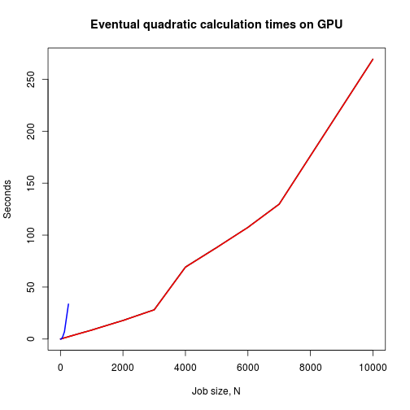

# CUDA vs MPI on the nbody problem

## The problem

Compare calcultion times of a small computational cluster against a single, cheap GPU on an N-Body simulation with floating point accuracy.

## Findings

In this particular context, GPU computing is extremely efficient per cost. It should be remembered that GPU calculation follows the SIMD (Single Instruction Multiple Data) paradigm and thus is not suited to many applications. However, it is extremely cost effective when applied correctly.

## Hardware

### MPI

The MPI code ran on a small allocation of cluster resources, specifically

* 3 nodes each with 2x quad-core Xeon x5550 2.67GHz Intel processors
* 1 Gb Ethernet

### CUDA

The CUDA code ran on a single node with a single GPU, specifically

* Host: AMD FX(tm)-8320 Eight-Core Processor
* GPU: NVIDIA GeForce GTX 570, 480 CUDA cores

## Implementation

### MPI

Each MPI process communicates in a ring network topology, exemplifying a key distiction between distributed computing and the GPU's advantage as a PRAM. Each of N processes has O(N) work to do and communicates a message of size O(N), so losses may not be large. An nbody simulation with N bodies has N processes.

### CUDA

Iterations are designed to sustain large simulations and thus utilize more than one block, requiring CPU-synchronization. Asychronus kernel launches on a single stream avoid waiting for CPU-GPU communication. Kernels are queued in a single stream on the GPU, allowing them to be run from the GPU. An nbody simulation of N bodies has N threads.

Despite having a decent CPU available to the CUDA implementation, only a single thread was used on the CPU and it did very little work compared to the GPU.

## Computation time against job size

Here, we can see the natural quadratic complexity of the problem devestating the computation time on the cluster. Keep in mind that the GPU has 480 cores at its disposal, hence the linear behaviour.


```r
N = c(2, 4, 8, 16, 32, 64, 128, 256)
gpuALL = c(93234, 118949, 115853, 218249, 342299, 630782, 1171649, 2293604)
gpuKERNEL = c(13802, 33688, 65721, 133908, 273182, 545879, 1095429, 2200763)
mpi = c(4904, 10492, 24313, 76070, 261535, 1516904, 7077777, 33671758)
plot(N, gpuALL, type = "l", lwd = 2, ylim = c(0, max(gpuALL)), xlab = "Job size, N", 
    ylab = "computation time, microseconds", main = "Time vs work, GPU kernel & communication (black)\n vs GPU kernel (red) vs Cluster (blue)")
lines(N, gpuKERNEL, col = "red", lwd = 2)
lines(N, mpi, col = "blue", lwd = 2)
```

 


Using a larger dataset, the previous simulations are extended to demonstrate the inevitable quadratic curving of caclulation times for the GPU. The MPI times are included for a visual reference. It is impressive that it took 6 times more threads than CUDA cores before quadratic growth is observable. Extra MPI threads were not run because MPI is not designed to run this many threads.


```r
NN = c(N, 1000, 2000, 3000, 4000, 5000, 6000, 7000, 10000)
gpuALLMORE = c(gpuALL, 8653367, 17863950, 28156505, 69230652, 88070248, 107483798, 
    129807790, 269304295)
gpuKERNELMORE = c(gpuKERNEL, 8589575, 17795616, 28092732, 69168606, 88002472, 
    107423032, 129736739, 269238308)
plot(NN, gpuALLMORE/1e+06, type = "l", lwd = 2, ylim = c(0, max(gpuALLMORE/1e+06)), 
    xlab = "Job size, N", ylab = "Seconds", main = "Eventual quadratic calculation times on GPU")
lines(NN, gpuKERNELMORE/1e+06, lwd = 2, col = "red")
lines(N, mpi/1e+06, col = "blue", lwd = 2)
```

 


## Speedup, MPI over CUDA

This is NOT classic speed up, but the following.

$$my \; SpeedUp = \frac{S_{MPI}}{S_{CUDA}}$$


```r
plot(N, mpi/gpuALL, type = "l", lwd = 2, col = "red", xlab = "Job size, N", 
    ylab = "Times faster", main = "SpeedUp MPI / CUDA")
```

 


## Efficiency, MPI over CUDA cores

This is NOT classic efficienty, but the following.

$$my \; Efficiency = \frac{S_{MPI}}{(\# \; CUDA \; cores) \times S_{CUDA}}$$


```r
plot(N, mpi/(N * gpuALL), type = "l", lwd = 2, col = "red", xlab = "Job size, N", 
    ylab = "Efficiency", main = "Efficiency of each CUDA core against the entire MPI process")
```

 


